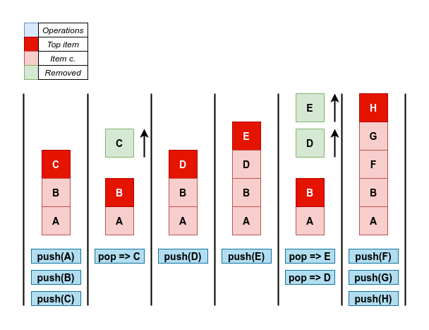
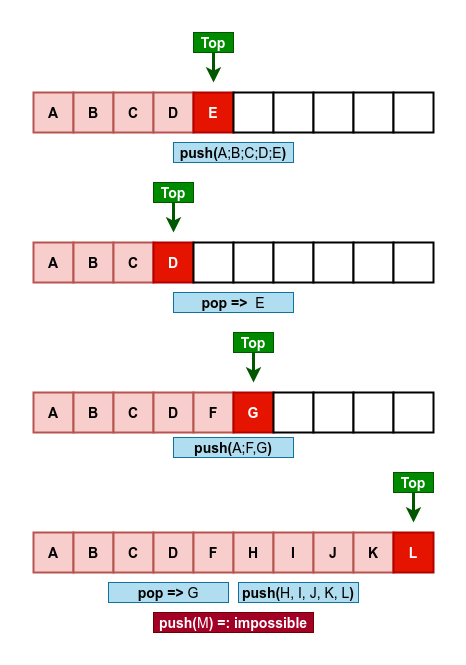
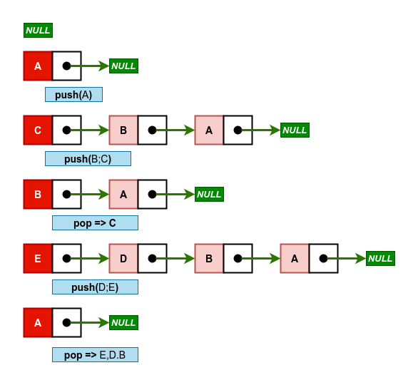

# STACK (PILHA)

Em ciência da computação, uma pilha é um conjunto  ordenado de itens no qual podem ser inseridos e a partir do qual podem ser eliminados em uma única extremidade - topo da pilha.

Devido a sua forma de operação essa estrutura de dados possui também um nome alternativo - LIFO (Last-In, Fist-Out) - ou em bom português - UEPS (Último a Entrar é o Primeiro a Sair).

----
## Operações Primitivas
As duas mudanças  que  podem  ser introduzidas numa pilha recebem nomes especiais.  Quando um item é incluído numa pilha, ele é "empilhado"  sobre a pilha   e,  quando  um  item  é  removido,  ele  é "desempilhado".

> `Definições`:
> - `s: pilha`
> - `i: item`
> - `O(x): complexidade pior caso`

- is_empty(s) =: `O(1)`: verifica se *s*  está vazio.
- pop(s) =: `O(1)`: operação que removerá o item superior de *s* e o retornará como valor da função. 
- push(s, i) =: `O(1)`: está operação incluirá o item *i* na pilha *s*.
- peek(s) =: `O(1)`: retorna o item superior da pilha, mas não o remove.  

  <figure>
    
    <figcaption>
      <i>Diagrama de operações primitivas em uma pilha. O parâmetro "s" foi omitido nas operações.</i>
    </figcaption>
  </figure>

### Demais operações *(opcionais)*:
- is_full(s) =: `O(1)`: verifica se a pilha *s* está cheia. Sua utilização apenas se faz necessária em pilhas estáticas.
- clear(s) =: `O(n)`: remove todos os itens de *s*;
- search(s, i) =: `O(n)`: procura pelo item *i* na pilha *s*. Caso *i* esteja em *s* é retornado o deslocamento de *i* em relação ao topo de *s*, ou seja, quantos *pop(s)* é necessário para levar *i* até o topo. Caso *i* não seja encontrado é retornado -1 (ou um valor arbitrário que não cause confusão).

## [Static Stack (Pilha Estática)](./stack_static.c) 

- Sua implementação é feita com a utilização de vetor (array).
- Portanto, os itens são armazenados em um bloco contíguo de memória. Acesso indexado.
- A utilização de vetor permiti um menor consumo de memória por item, já que não precisa guardar a referência para o próximo bloco. Em contrapartida há limite de inserção - tamanho fixo.
- Sem uma estimativa de quantos espaços serão necessários pode haver tanto desperdício de memória quanto a impossibilidade de inserir novos itens.

  <figure>
    
    <figcaption>
      <i>Diagrama de operações primitivas em uma pilha estática.</i>
    </figcaption>
  </figure>

## [Dynamic Stack (Pilha Dinâmica)](./stack_dynamic.c)

- Implementação com a utilização de lista ligada (Linked List).
- Alocação de memória dinâmica.
- Maior consumo de memória por item: além das informações em si, também é necessário guardar o endereço do próximo bloco. Porém é compensado com alocação de itens por demanda, matendo em memória apenas aqueles que realmente são utilizados.
- Não há limite de inserção - limite é a quantidade de memória disponível.

  <figure>
    
    <figcaption>
      <i>Diagrama de operações primitivas em uma pilha dinâmica.</i>
    </figcaption>
  </figure>

## Problems (Problemas)

- [Pilha Antigo - The Huxley](https://thehuxley.com/problem/2394) | [Resolução](https://github.com/jytaloramon/competitive-programming/blob/master/TheHuxley/N3_Pilha%20Antigo.c)

- [Todos os subconjuntos - The Huxley](https://thehuxley.com/problem/419) | [Resolução](https://github.com/jytaloramon/competitive-programming/blob/master/TheHuxley/N4_Todos%20os%20subconjuntos.c)

 

----

## Referências
- Augenstein, M. J.; Langsam, Y.; Tenenbaum, A. M. Estruturas de Dados Usando C. Londres: Pearson Universidades, 1995.
- [Wikipedia](https://pt.wikipedia.org/wiki/Pilha_(inform%C3%A1tica))